# Гайд по установке VS Code для решения задач
## Установка VS Code
[Ссылка на скачивание](https://code.visualstudio.com/download)
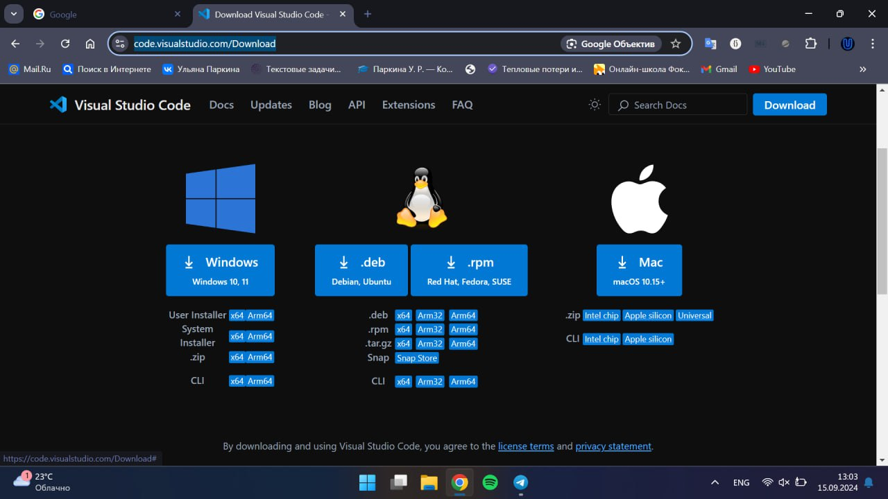
Установите, откройте и создайте директорию с файлом.
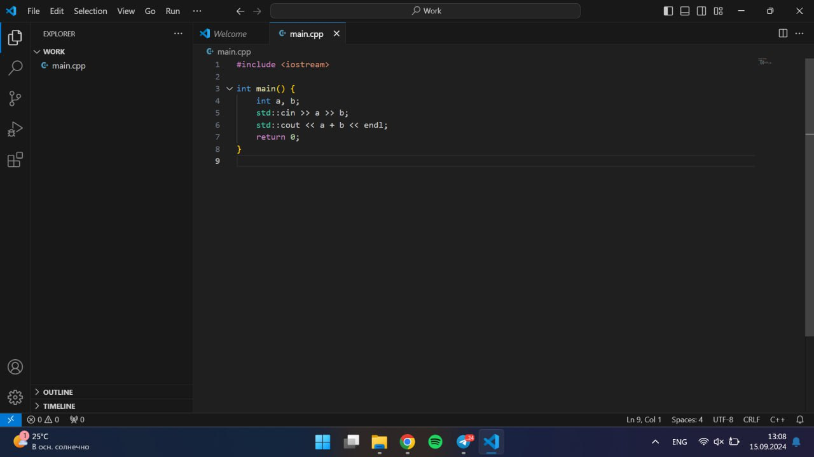
Откройте расширения VS Code
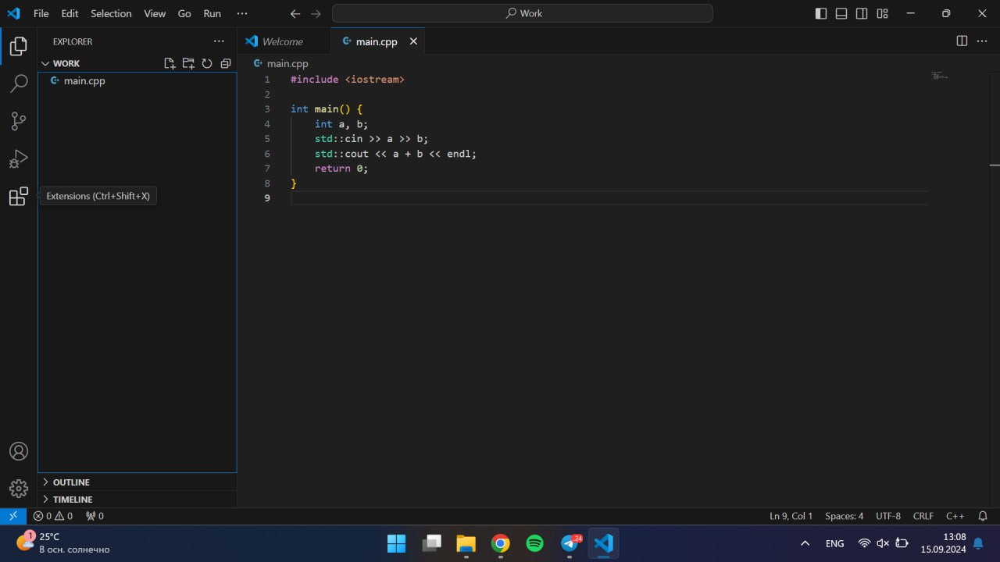
Скачайте два нужных расширения
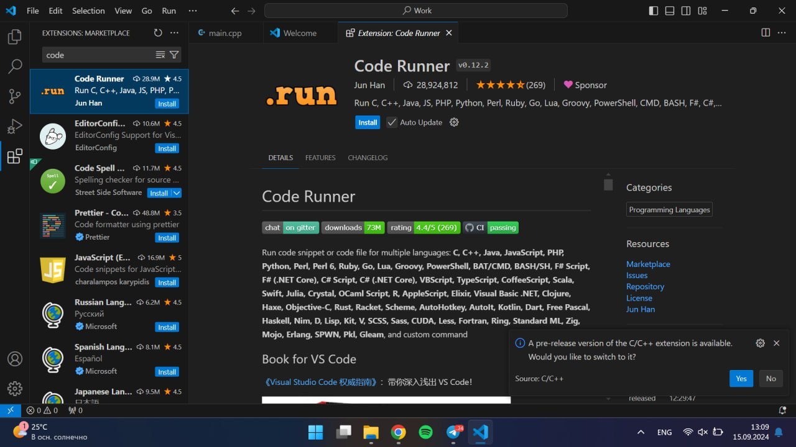
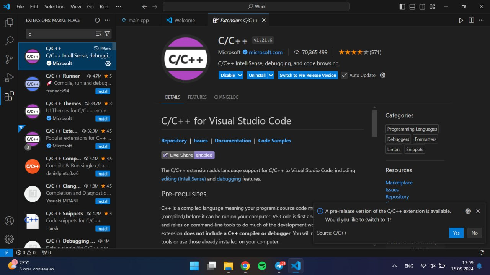
Зайдите в настройки и поставьте такую настройку
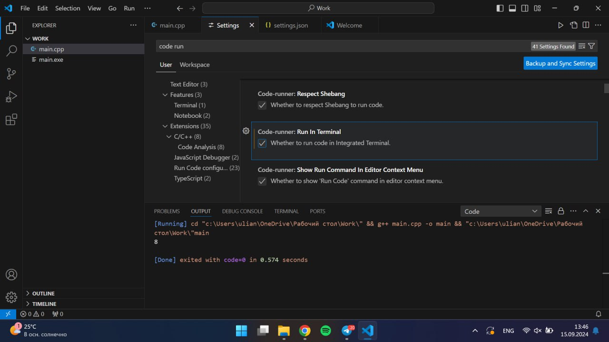

## Установка MinGW
[Ссылка на скачивание](https://www.msys2.org/)
После у вас откроется терминал. Введите в него команду:
```
pacman -S mingw-w64-ucrt-x86_64-gcc
```
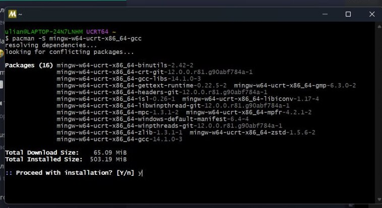
После успешной установки, откройте настройки системы, о системе
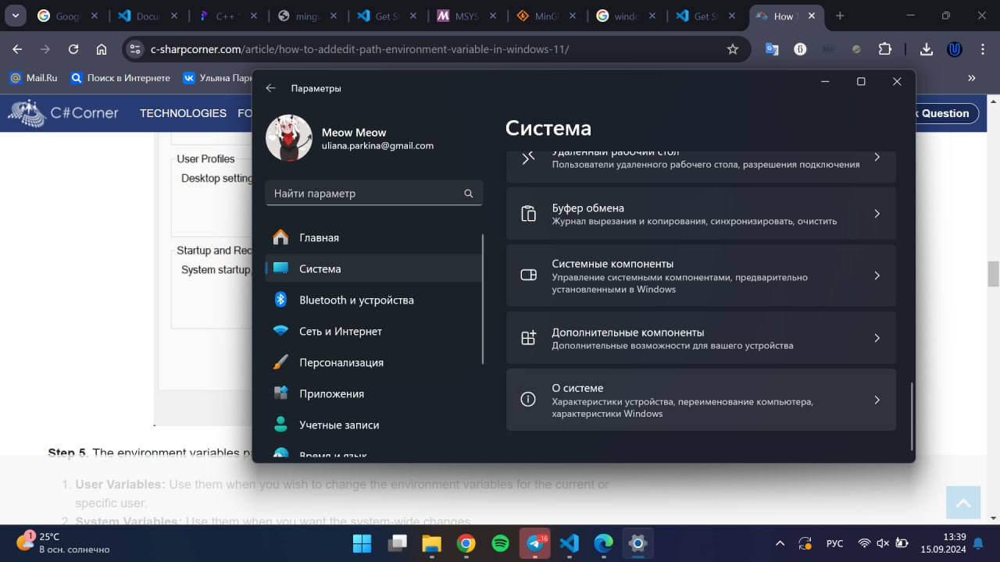
Дополнительные параметры
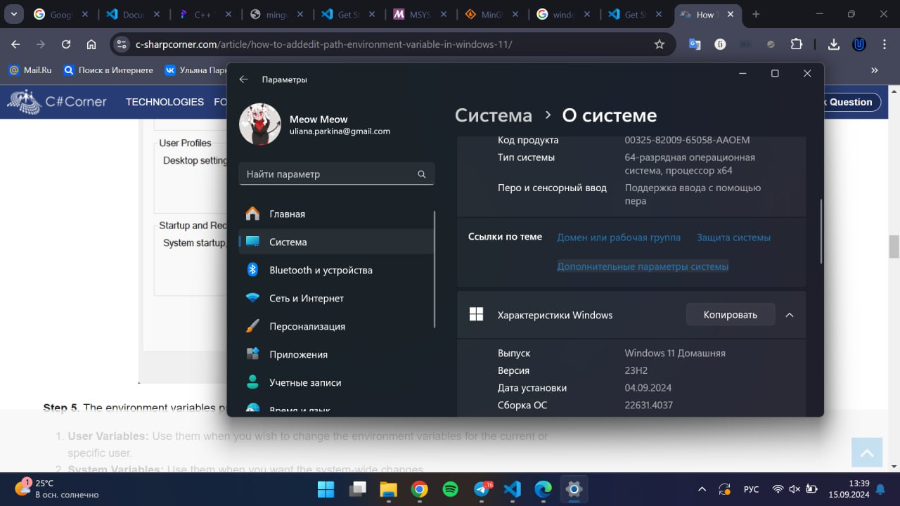
Добавьте путь к MinGW
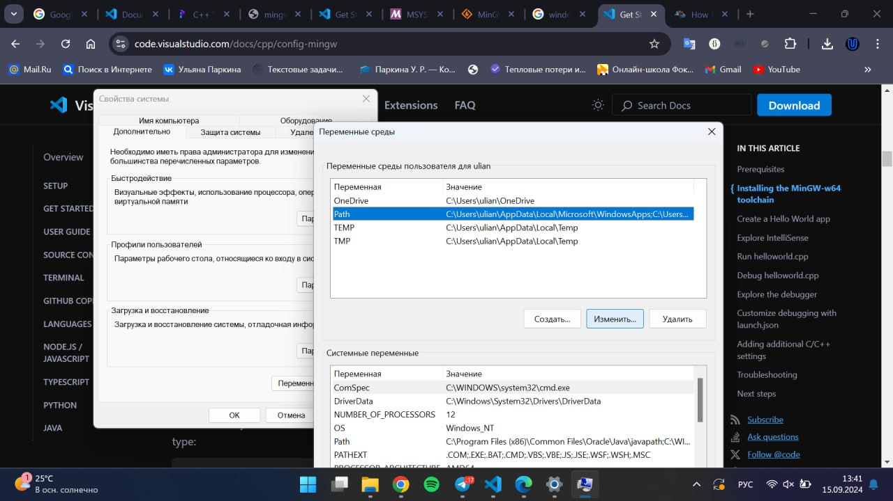
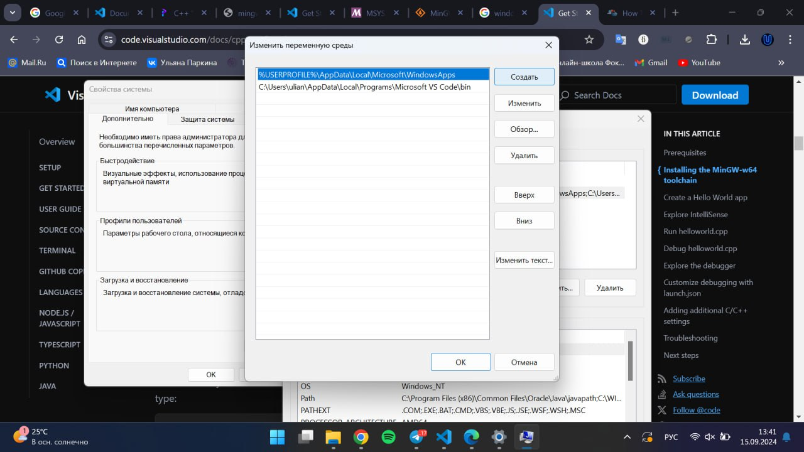
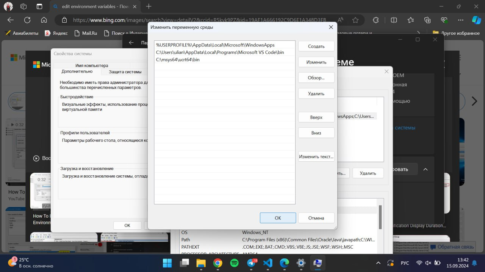
## Запуск
Откройте VS Code, кликните правым кликом и выбирите Run Code
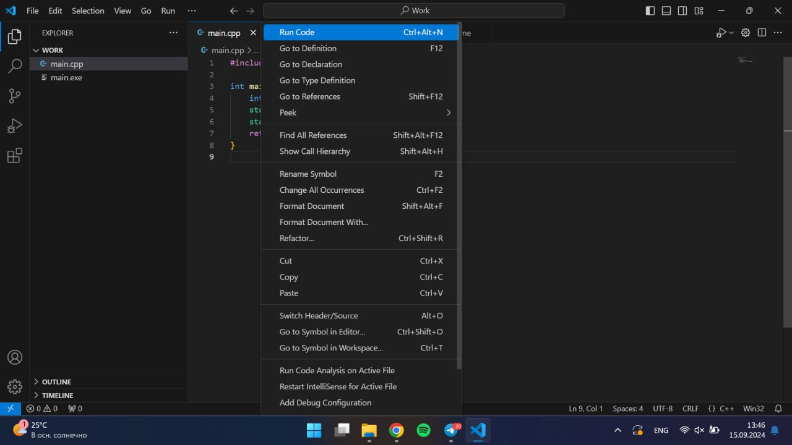
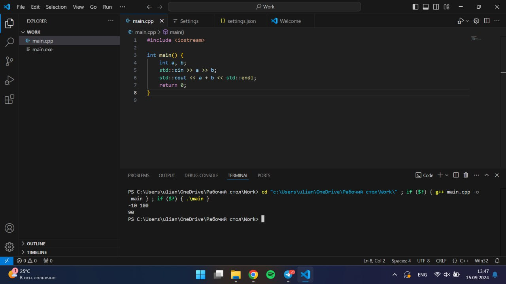


